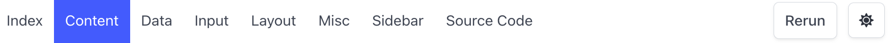

# Navbar

Here is the navbar of [toolgui-demo](https://toolgui-demo.fly.dev/index).

The left part will be buttons which nav to the pages in App.
The right part will be two button:

1. Rerun: Rerun the Page Func without changing any state.
2. Dark/Light Mode Switch

The button of current page will be highlighted with a specific style.
