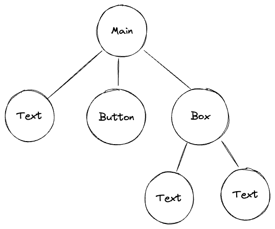

# Components

## Component Tree / Forest

When every component created, we need to assign **where it should generate**.
The root will be Main Container or Sidebar Container.
Hence the relation between components is trees.

For example, if a page function implements as:

```go
tgcomp.Text(p.Main, "Text")
tgcomp.Button(p.State, p.Main, "Button")
box := tgcomp.Box("box")
tgcomp.Text(box, "Text1")
tgcomp.Text(box, "Text2")
```

Then the **Component Tree** will be:


