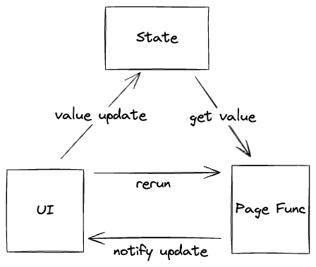
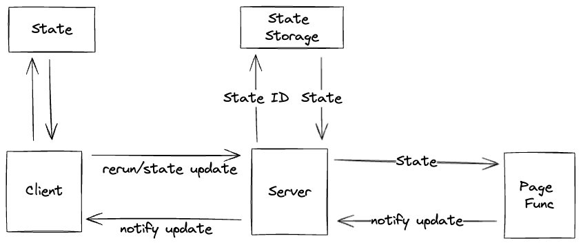

# How it works?

## Basic



The key concept is that in the **Page Function**,
the UI component interact immediately with the running logic.

For example:

```go
if tgcomp.Button(p.State, p.Main, "Click me") {
    tgcomp.Text(p.Main, "Hi")
}
```

In the first call (For example: When the web page is entering.),
The `Click me` button will render, but the `Hi` will not render.
Since the button is not clicked in the first round.

When the user clicks the button, the **Page Function** will be called again.
In this round, `tgcomp.Button` will return `true` and `Hi` will render.

How?

Since we delcare a button which its id is `Click me`, and when the button clicked,
we store `true` with key `Click me` into `p.State`.

When entering `tccinput.Button`, it will check if there is any data store
in `p.State` with key `Click me`.

## Server-Client Architecture



Server-Client need to handle a more complex part: multiple state for multiple users.
Hence we need a `state_id` for each state.

The server part is responsible for the state pool.
