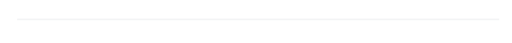

# Divider

Divider component display a horizontal line.

## API

```go
func Divider(c *tgframe.Container)
func DividerWithID(c *tgframe.Container, id string)
```

* `c` is Parent container.
* `id` is a user specific element id.

## Example

```go
tgcomp.Divider(p.Main)
```

