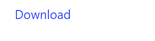

# Download Button

DownloadButton create a download button component.

## API

```go
func DownloadButton(c *tgframe.Container, text string, body []byte, filename string)
func DownloadButtonWithID(c *tgframe.Container, text string, body []byte, filename, id string)
```

* `c` is Parent container.
* `text` is the link text.
* `body` is the bytes of file.
* `id` is a user specific element id.

## Example

```go
tgcomp.DownloadButton(p.Main,
    "Download", []byte("123"), "123.txt")
```

