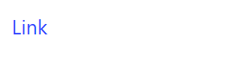

# Link

Link component display a link.

## API

```go
func Link(c *tgframe.Container, text, url string)
func LinkWithID(c *tgframe.Container, text, url, id string)
```

* `c` is Parent container.
* `text` is the link text.
* `url` is the link url.
* `id` is a user specific element id.

## Example

```go
tgcomp.Link(p.Main, "Link", "https://www.example.com/")
```


