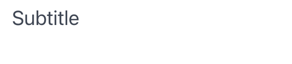

# Subtitle

Subtitle component display a subtitle.

## API

```go
func Subtitle(c *tgframe.Container, text string)
func SubtitleWithID(c *tgframe.Container, text string, id string)
```

* `c` is Parent container.
* `text` is the subtitle text.
* `id` is a user specific element id.

## Example

```go
tgcomp.Subtitle(p.Main, "Subtitle")
```



