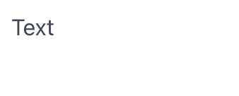

# Text

Text component display a text.

## API

```go
func Text(c *tgframe.Container, text string)
func TextWithID(c *tgframe.Container, text string, id string)
```

* `c` is Parent container.
* `text` is the text.
* `id` is a user specific element id.

## Example

```go
tgcomp.Text(p.Main, "Text")
```


