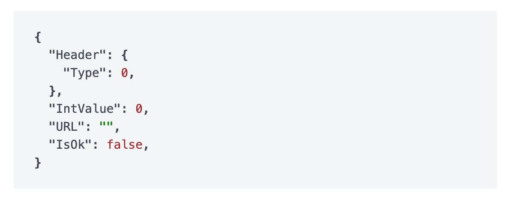

# JSON

JSON component display the JSON representation of an object.

## API

```go
func JSON(c *tgframe.Container, v any)
```

* `c` is Parent container.
* `v` is the object.
  * string: assume to be a serialized JSON string.
  * other: assume to be a struct and will be converted to a JSON string.

## Example

```go
type DemoJSONHeader struct {
	Type int
}

type DemoJSON struct {
	Header   DemoJSONHeader
	IntValue int
	URL      string
	IsOk     bool
}

tgcomp.JSON(p.Main, &DemoJSON{})
```


