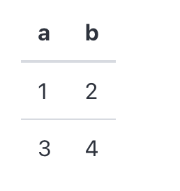

# Table

Table component display a table.

## API

```go
func Table(c *tgframe.Container, head []string, table [][]string)
```

* `c` is Parent container.
* `head` is the head of table.
* `body` is the body of table.

## Example

```go
tgcomp.Table(p.Main, []string{"a", "b"}, [][]string{{"1", "2"}, {"3", "4"}})
```

