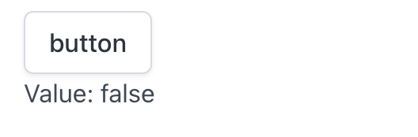

# Button

Button create a button and return true if it's clicked.

## API

```go
func Button(s *tgframe.State, c *tgframe.Container, label string) bool
```

* `s` is State.
* `c` is Parent container.
* `label` is the text on button.

## Example

```go
btnClicked := tgcomp.Button(p.State, p.Main, "button")
if btnClicked {
	tgcomp.TextWithID(p.Main, "Value: true", "button_result")
} else {
	tgcomp.TextWithID(p.Main, "Value: false", "button_result")
}
```

