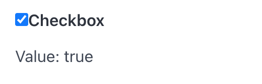

# Checkbox

Checkbox create a checkbox and return true if it's checked.

## API

```go
func Checkbox(s *tgframe.State, c *tgframe.Container, label string) bool
```

* `s` is State.
* `c` is Parent container.
* `label` is the text on checkbox.

## Example

```go
checkboxValue := tgcomp.Checkbox(p.State, p.Main, "Checkbox")
if checkboxValue {
	tgcomp.TextWithID(p.Main, "Value: true", "checkbox_result")
} else {
	tgcomp.TextWithID(p.Main, "Value: false", "checkbox_result")
}
```


