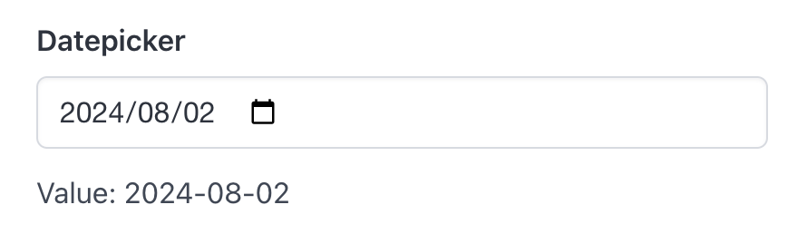

# Datepicker

Datepicker create a datepicker and return its selected date.

## API

```go
func Datepicker(s *tgframe.State, c *tgframe.Container, label string) string
```

* `s` is State.
* `c` is Parent container.
* `label` is the label for datepicker.

## Example

```go
dateValue := tgcomp.Datepicker(p.State, p.Main, "Datepicker")
tgcomp.TextWithID(p.Main, "Value: "+dateValue, "datepicker_result")
```


