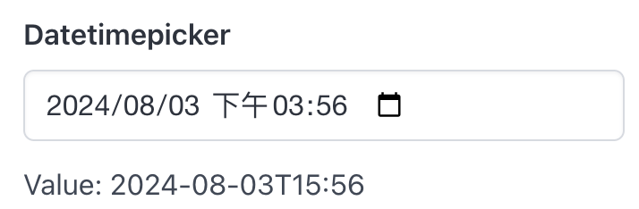

# Datetimepicker

Datetimepicker create a datetimepicker and return its selected datetime.

## API

```go
func Datetimepicker(s *tgframe.State, c *tgframe.Container, label string) string
```

* `s` is State.
* `c` is Parent container.
* `label` is the label for datetimepicker.

## Example

```go
dateValue := tgcomp.Datetimepicker(p.State, p.Main, "Datetimepicker")
tgcomp.TextWithID(p.Main, "Value: "+dateValue, "datetimepicker_result")
```


