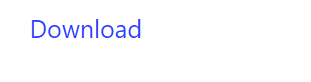

# Download Button

DownloadButton create a download button component.

## API

### Interface

```go
func DownloadButton(s *tgframe.State, c *tgframe.Container, text string, body []byte) bool
func DownloadButtonWithConf(s *tgframe.State, c *tgframe.Container, text string, body []byte, conf *DownloadButtonConf) bool
```

### Parameters

* `c` is Parent container.
* `text` is the link text.
* `body` is the bytes of file.
* `filename` is the file name.
* `conf` is the configuration of the download button.

```go
type DownloadButtonConf struct {
	// MIME specifies the Multipurpose Internet Mail Extension (MIME) type of the downloaded content.
	// Defaults to "application/octet-stream" if not provided.
	MIME string

	// Color defines the color of the download button.
	Color tcutil.Color

	// Disabled indicates whether the download button should be initially disabled.
	Disabled bool

	// Filename sets the suggested filename for the downloaded content when clicked.
	Filename string

	ID string
}
```

## Example

```go
tgcomp.DownloadButton(p.State, p.Main,
    "Download", []byte("123"), "123.txt")
```

