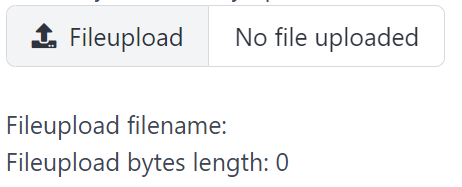

# Fileupload

Fileupload create a fileupload and return its selected file.

## API

```go
type FileObject struct {
	Name string `json:"name"`
	Type string `json:"type"`
	Size int    `json:"size"`

	Bytes []byte `json:"_"`
}

func Fileupload(s *tgframe.State, c *tgframe.Container, label, accept string) *FileObject
```

* `s` is State.
* `c` is Parent container.
* `label` is the label for options group.
* `accept` is the file type to accept.
* Return the selected file object. nil if no file is selected.

## Example

```go
fileObj := tgcomp.Fileupload(p.State, p.Main, "Fileupload", ".jpg,.png")
if fileObj != nil {
    tgcomp.Text(p.Main, "Fileupload filename: "+fileObj.Name)
    tgcomp.Text(p.Main, fmt.Sprintf("Fileupload bytes length: %d", len(fileObj.Bytes)))
}
```


