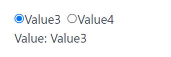

# Radio

Radio create a group of radio items and return its selected value.

## API

```go
func Radio(s *tgframe.State, c *tgframe.Container, label string, items []string) *int
```

* `s` is State.
* `c` is Parent container.
* `label` is the label for options group.
* `items` is the list of options.
* Return the index of the selected item, 0-indexed. nil if no item is selected.

## Example

```go
radioIndex := tgcomp.Radio(p.State, p.Main, "Radio", []string{"Value3", "Value4"})
if radioIndex != nil {
	tgcomp.TextWithID(p.Main, fmt.Sprintf("Value: Value%d", *radioIndex + 3), "radio_result")
}
```


