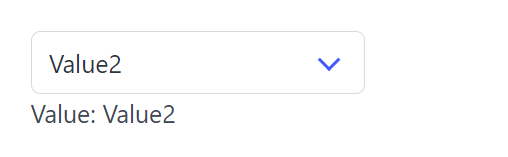

# Select

Select create a select dropdown list and return its selected value.

## API

```go
func Select(s *tgframe.State, c *tgframe.Container, label string, items []string) string
```

* `s` is State.
* `c` is Parent container.
* `label` is the label for select.
* `items` is the list of options.

## Example

```go
selValue := tgcomp.Select(p.State, p.Main, "Select", []string{"Value1", "Value2"})
tgcomp.TextWithID(p.Main, "Value: "+selValue, "select_result")
```


