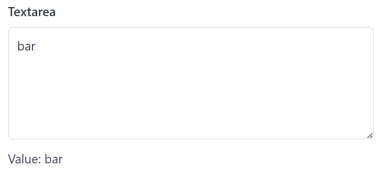

# Textarea

Textarea create a textarea and return its value.

## API

```go
func Textarea(s *tgframe.State, c *tgframe.Container, label string, height int) string
```

* `s` is State.
* `c` is Parent container.
* `label` is the label for textbox.
* `height` is heigh of the textarea.

## Example

```go
textareaValue := tgcomp.Textarea(p.State, p.Main, "Textarea", 5)
tgcomp.TextWithID(p.Main, "Value: "+textareaValue, "textarea_result")
```


