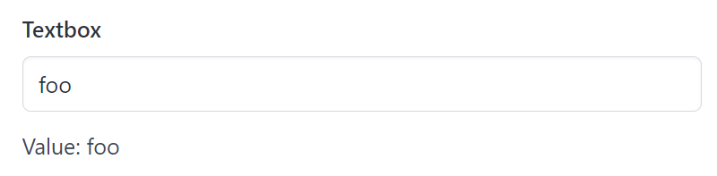

# Textbox

Textbox create a textbox and return its value.

## API

```go
func Textbox(s *tgframe.State, c *tgframe.Container, label string) string
```

* `s` is State.
* `c` is Parent container.
* `label` is the label for textbox.

## Example

```go
textboxValue := tgcomp.Textbox(p.State, p.Main, "Textbox")
tgcomp.TextWithID(p.Main, "Value: "+textboxValue, "textbox_result")
```


