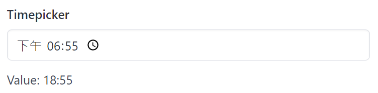

# Timepicker

Timepicker create a timepicker and return its selected time.

## API

```go
type Time struct {
	Hour int
	Minute int
}

func Timepicker(s *tgframe.State, c *tgframe.Container, label string) *Time
```

* `s` is State.
* `c` is Parent container.
* `label` is the label for timepicker.
* Return the selected time. nil if no time is selected.

## Example

```go
timeValue := tgcomp.Timepicker(p.State, p.Main, "Timepicker")
if timeValue != nil {
	text := fmt.Sprintf("Value: %02d:%02d", timeValue.Hour, timeValue.Minute)
	tgcomp.TextWithID(p.Main, text, "timepicker_result")
}
```



