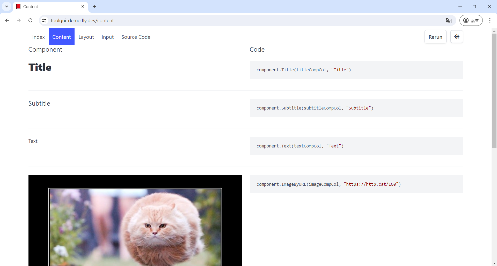

# ToolGUI

This Go package provides a framework for rapidly building interactive data
dashboards and web applications. It aims to offer a similar development
experience to Streamlit for Python users.

> ⚠️ Under Development:
> 
> The API for this package is still under development,
> and may be subject to changes in the future.

Demo page: [https://toolgui-demo.fly.dev/](https://toolgui-demo.fly.dev/)

